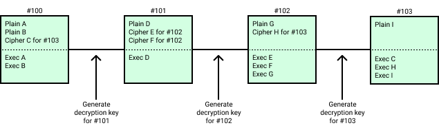

_[Originally posted](https://ethresear.ch/t/shutterized-beacon-chain/12249) at the Ethereum Research forum._

Shutterized Beacon Chain
========================

Acknowledgement
------------------------------------------------------------------------------------------

We'd like to thank [@mkoeppelmann](https://ethresear.ch/u/mkoeppelmann) for coming up with the idea and collaborating with us on the proposal, [@JustinDrake](https://ethresear.ch/u/justindrake) for helpful discussions and creative ideas, as well as to Sebastian Faust and Stefan Dziembowski for designing Shutter's DKG protocol.

Summary
--------------------------------------------------------------------------

-   MEV is an important problem, but it can be solved directly in an L1 beacon chain
-   Shutter provides a solution for that: A set of nodes compute an encryption key using a DKG protocol, let users encrypt their transactions with it, and release the decryption key once the encrypted transactions are in the chain.
-   This technique can be applied to Ethereum-like beacon chains, by using the validator set to run the DKG protocol and introducing a scheduling mechanism for encrypted transactions.

The problem
----------------------------------------------------------------------------------

Miner-extractable value (MEV) and front running are widely recognized to be among the final unsolved fundamental issues in the blockchain space. There are now hundreds of millions of dollars of documented MEV, most of which is tremendously harmful for users and traders. This problem will inevitably become more devastating over time and eventually could even pose a fatal obstacle on our community's path to mainstream adoption.

The term MEV was coined by Phil Daian et al. and describes revenue that block producers can extract by selecting, injecting, ordering, and censoring transactions. The MEV extracted in 2020 alone was worth more than $314M --- and that is only a lower bound. Oftentimes, the MEV is not captured by the block producers themselves, but rather by independent entities using sophisticated bots.

An important subset of MEV is the revenue extracted by so-called front running --- an attack that is illegal in traditional markets, but uncontrolled in the crypto space. A front runner watches the network for transactions that are worth targeting. As soon as they find one, they send their own transaction, trying to get included in the chain beforehand. They achieve this by paying a higher gas price, operating world-spanning network infrastructure, being a block producer themselves, or paying one via a back channel.

The most frequent victims of front running attacks are traders on decentralized exchanges. Front running makes them suffer from worse prices instead of being fairly rewarded for the information they provide to the market. On the other side, front runners siphon off profits from their victims in a nearly risk-free fashion without contributing anything useful to the system. A simple example of this are arbitrage transactions benefitting from the price difference of the same asset on two different DEX's. Front runners regularly copy these kinds of transactions from other market participants and execute them earlier, reaping the rewards, whereas the original trader comes away empty-handed.

Besides exchanges, many other applications can be affected as well, including bounty distributions and auctions. Importantly, because they rely on voting, governance systems, which represent a large and fast-growing field within Ethereum, are prone to front running and could face significant challenges without a system that protects against these types of attacks.

In traditional finance, front running can be curbed (somewhat) via regulation or oversight by various trusted intermediaries and operators. In permissionless, decentralized systems this is not the case, so it might be a strategic blocker to mainstream crypto adoption.

Requirements
------------------------------------------------------------------------------------

We believe the beacon chains should be MEV protected for their users with no overhead or changes in terms of user experience. This protection should also come with no additional security guarantees, or, should at least fallback to the standard non-MEV protected functionning in case the added security assumptions fail. Lastly, it should work with a similar decentralization level as the consensus protocol.

Shutter
--------------------------------------------------------------------------

Shutter allows users to send encrypted transactions in a way that protects them from front runners on their path through the dark forest (the metaphorical hunting ground of front runners that each transaction must cross). For example, a trader could use Shutter to make their order opaque to front runners, which means attackers can neither determine if it is a buy or a sell order, nor which tokens are being exchanged, or at which price. The system will only decrypt and execute a transaction after it has left the dark forest, i.e. after the execution environment of the transaction has been determined.

The keys for encryption and decryption are provided by a group of special nodes called keypers. Keypers regularly produce encryption keys by running a distributed key generation (DKG) protocol. Later, they publish the corresponding decryption key. The protocol uses threshold cryptography --- a technique enabling a group of key holders to provide a cryptographic lock that can only be opened if at least a certain number of the members collaborate. This ensures that neither a single party, nor a colluding minority of keypers, can decrypt anything early or sabotage the protocol to stop it from executing transactions. As long as a certain number of keypers (the "threshold") is well-behaved, the protocol functions properly.

L1 Shutter in core protocol
------------------------------------------------------------------------------------------------------------------

We have already developed on-chain shutter, a mechanism to protect individual smart contracts from ordering attacks on L1, but it has the drawback of breaking composability. We are further working on implementing shutter directly inside roll-ups. Here we will describe a design to integrate the shutter system as part of Ethereum-like beacon chains. This has the benefit of being completely abstracted away from the user, and conserving composability.

As in every shutter system, the protocol needs a set of keypers. The keyper set is selected among chain validators by similar procedures selecting committees or block producers, except they would be selected much less frequently (e.g. once a day). Keypers use the beacon chain to generate a shared eon key. The eon public key will be made available to users to encrypt their transactions.

Block producers collect encrypted as well as plaintext transactions for a block. They include in their blocks the plaintext transactions to be executed, while encrypted transactions are scheduled for a future block height.

After a block is produced, the keypers should generate the decryption key allowing to decrypt the transactions scheduled for that block. The following block must include the decryption key to be considered valid. The post state of the block is computed by executing first the encrypted transactions scheduled for that block, before executing the plaintext transactions included in that block.

The execution order and context (block number, timestamp, etc ...) is determined by the order of inclusion of ciphertext transactions and the context of the previous block. The context of execution being determined before the decryption of the transaction, it is impossible to use information about the transaction data to extract MEV. It also prevents side-channel information that could be used to optimistically front-run a transaction.

### Ciphertext transaction fees

Block producers need to somehow ensure that encrypted transactions are worth including in a block, i.e. that they can pay for a transacion fee, without knowing the transaction data. If the fee would be paid at time of execution, the block producer would not be guaranteed to be paid, since the account could be depleted in between inclusion and execution.

Therefore, encrypted transactions justify their inclusion by providing a signed `envelope` paying the fees at the moment of its inclusion in the chain. The envelope includes the fields: `gas consumption`, `gas price`, and a signature on these fields, allowing to recover the `fee payer` address. The fee will be paid on inclusion of the ciphertext transaction to the block producer, i.e. not at the time of execution. The gas consumption of the ciphertext transaction counts towards the gas limit of the block it was included in.

The traditional `gas limit` needs to be replaced with `gas consumption`, meaning that the user will pay for all the gas it plans to use, even if it uses only part of it at the time the transaction is decrypted and applied. This is necessary for the fee to be paid at the time of the transaction inclusion in the chain. This prevents blocks producers from having to include a transaction with an incredibly high `gas limit` (taking the place of other transactions and their fees) that decrypts to a transaction with very little `gas used` (and fees).

The other drawback of using envelope transaction is that meta-data of the transaction are leaked, i.e. the fee payer and gas price / upper limit of consumption are known. Potentially, a small part of MEV can still be extracted using this leaked information.

It has been pointed out that a zk-SNARK approach could be envisonned to solve this fee payment problem as well, and prevent the leaking meta-data information.

### Security guarantees

The eon public key and decryption keys generated by keypers require a t out of n threshold of honest participants. The parameters t and n can be played with to adapt the protocol. The higher t, the harder for keypers to collude and decrypt transactions too early (allowing MEV extraction). On the other hand, a lower t will guarantee that the decryption key is released in a timely manner.

To enforce decryption and application of ciphertext transactions, we have to enforce inclusion of the decryption key in each block. In these conditions, if keypers turn offline or refuse to produce a decryption key, the block production will halt.

We can mitigate the liveness influence of keypers by allowing to produce a block without a decryption key if there is no encrypted transaction scheduled for execution. In case keypers go offline, the chain would recover by forking away the blocks with encrypted transactions and produce blocks only with plaintext transactions.

We can also recover liveness by stating that if no block is produced during n slots (due to not having the decryption key), the next block does not need to include a decryption key, and decrypted transactions are ignored. This will fall back to the legacy non-MEV protected functionning of the chain.

### Changes to the implementation

The keyper software has already been developed, as well as all the encryption / decryption logic. We also developed the logic allowing a block producer (or collator / sequencer) to commit to a batch of encrypted transactions, signaling to the keypers that it is now safe to release the decryption key.

What needs to be done is to change the rules that define correctness of a block in client implementations, as well as the rules for execution of transactions. The interface for submission of transaction to the client has to be redefined. Lastly, tools and plugins will likely have to be written to allow dapps to seamlessly integrate with an MEV protected chain requiring encryption of transactions with the public eon key.
