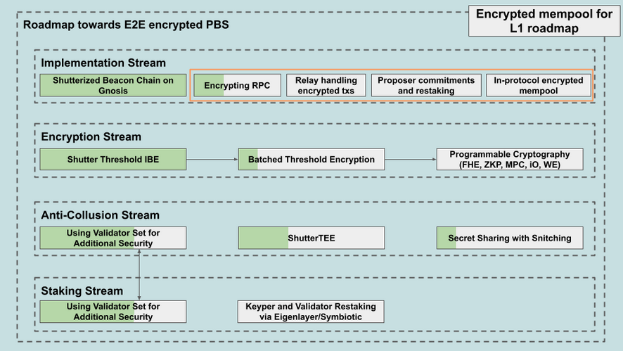
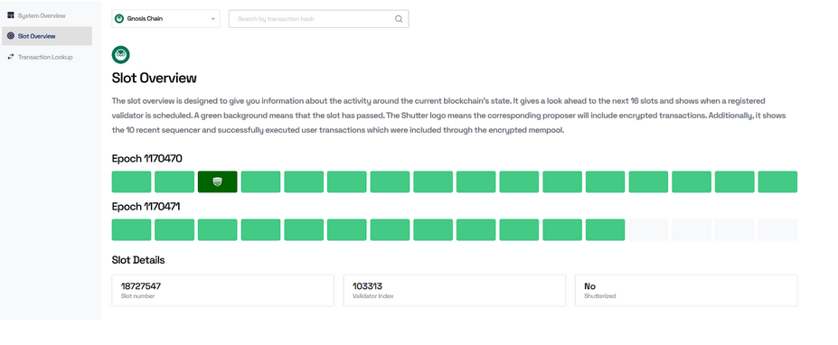

# The Road Towards an Encrypted Mempool On Ethereum L1

by Frederik Lührs, Luis Bezzenberger, Francesco Mosterts, Sebastian Faust, Andreas Erwig

Many thanks to Julian Ma, Drew Van der Werff, Alex Vinyas, Martin Köppelmann, Marc Harvey-Hill, Phillippe Schommers, and Julie Bettens for their valuable feedback on this document.

Ethereum's promise of decentralization, fairness, and security is challenged by issues like censorship, front-running, and builder centralization, making a case for encrypted mempools stronger than ever.

Who We Are:\
We are a group of projects and individuals building on Ethereum since 2014, dedicated to advancing the network's privacy, decentralization, and fairness. Our contributors include the Shutter Network, Gnosis, MEV Blocker, Nethermind, Chainbound, and more.

This post first touches on the general goals, challenges, and end vision for transaction encryption and then outlines a practical roadmap for implementing a threshold encrypted mempool using proposer commitments to integrate with Ethereum's PBS transaction supply chain. It explores how this approach could improve censorship resistance, mitigate malicious MEV, and ensure a fair transaction process.

The document represents one possible approach and shall act as a starting point for conversation. We invite feedback and contributions from all perspectives, particularly from those involved in the PBS supply chain, including RPC providers, relays, builders, and proposers.

Additionally, we're planning to design this integration as modularly as possible, leading to a generalized mempool encryption interface, which is as encryption technology-agnostic as possible.

## TL;DR/Table of Contents:

#### Problem:

-   Censorship & Front-Running: Exploitation of transaction ordering by validators/builders undermines Ethereum's openness and fairness.

-   Centralization: Proposer-Builder Separation (PBS) has led to builder centralization, increasing censorship and MEV risks.

-   MEV Challenges: Exploiting Maximal Extractable Value (MEV) harms users and compromises integrity.

#### Solution: Encrypted Mempools

-   Encrypt transactions to prevent front-running and censorship.

-   Decrypt only post-commitment, ensuring fairness and privacy.

-   Vitalik emphasizes the necessity for decentralized block building and MEV mitigation.

#### Endgame: Fully Private Ethereum

-   Employ cryptographic tools (e.g., FHE, ZK Proofs), integrated into the Ethereum L1 protocol for complete encryption.

-   Achieve censorship resistance, fairness, and decentralized transaction ordering.

-   Overcome current limitations with incremental steps toward scalability and decentralization.

#### Roadmap Highlights:

1.  Step 1 - RPC Integration: Enable encrypted transactions with eth_sendEncryptedTransaction via existing infrastructure like MEV Blocker.

2.  Step 2 - PBS Integration: Introduce relays and proposer commitments to secure transaction inclusion while maintaining privacy.

3.  Step 3 - In-Protocol Shutterization: Integrate threshold encryption into Ethereum's consensus layer for decentralized and secure transaction processing.

#### Who will make up the threshold committee

Economics impact

In-protocol implementation

Open questions

Further Improvements

## Problem

### Big picture: Censorship, Front-Running, Builder Centralization

Ethereum aims for decentralization and fairness but faces challenges in transaction processing. Malicious actors exploit the brief window before transactions are included in a block to censor, front-run, or reorder transactions, undermining the network's integrity.

Censorship and Front-Running. Validators or block producers might deliberately exclude or delay transactions, violating Ethereum's open-access principles and causing financial losses for users. Front-running occurs when someone observes pending transactions and inserts their own ahead to profit, harming users and compromising market integrity.

Centralization in Block Building. Proposer-Builder Separation (PBS) [was introduced to preserve the decentralization of the validator set](https://barnabe.substack.com/p/pbs). PBS acknowledges that block building is centralizing and aims to keep this centralization at the builder level, not at the proposer level. However with or without PBS, Ethereum is now facing a strong tendency towards builder centralization, with a few powerful builders controlling most of the blocks. This centralization increases risks like censorship and the rents that MEV extracting agents seek.

The Essential Role of Encrypted Mempools. In his recent blog post series "[Possible futures of the Ethereum protocol](https://vitalik.eth.limo/general/2024/10/20/futures3.html)", Vitalik emphasizes that to address these issues, we need to give transaction selection back to proposers (validators) and limit builders' roles. However, for this to work without introducing new vulnerabilities, encrypted mempools are crucial.

Encrypted mempools allow users to broadcast transactions in encrypted form, so block builders cannot see the details and thus cannot front-run or censor them. Transactions are decrypted later, ensuring a higher level of information symmetry during the transaction ordering process.

Vitalik highlights that encrypted mempools are essential for implementing solutions like BRAID, FOCIL, or multiple concurrent proposers (MCP), which aim to decentralize block construction and reduce MEV. We also think that [for inclusion lists to be widely adopted, an encrypted mempool is highly beneficial](https://x.com/ShutterNetwork/status/1796522253624258750) as well. Interestingly, our proposal for an encrypted mempool using proposer commitments integrates naturally with the concept of inclusion lists.

### Second order problems

Under the assumption that an encrypted mempool is the way forward to tackle the aforementioned issues, several additional challenges must be considered:

**Enforcing Reveal**

Ensuring that decryption keys are released on time is critical. Without a timely key release, encrypted transactions could remain locked, leading to delays or stalled transactions.

**Trust Assumptions**

All technologies that are currently being discussed in the community to enable encrypted mempools, such as Verifiable Delay Functions, Threshold Encryption, or Trusted Execution Environments, rely on certain trust assumptions. We discuss those assumptions in more detail below in "Technologies Enabling the Encrypted Mempool."

**Relationship with PBS**

Implementing an encrypted mempool is relatively straightforward on a basic Layer 1 blockchain, but integrating it under the assumption that out-of-protocol Proposer-Builder Separation (PBS) exists adds complexity. Finding a way to make encrypted transactions compatible under this assumption is a non-trivial challenge.

**Distribution of Back-Running MEV****

Some forms of MEV, like back-running, are considered acceptable and even beneficial. The challenge is to allow these while preventing malicious MEV and to ensure that the profits from back-running are fairly distributed.

**Verifiability and Accountability**

It's essential to have mechanisms in place to verify that all parties are following the protocol and to hold them accountable if they don't. This includes being able to detect misbehavior and apply penalties accordingly.

## The Endgame of Encryption: Ethereum with Fully Configurable, Decentralized Privacy

We think the ultimate aim for the Ethereum community is a fully encrypted and decentralized Ethereum where all transactions are private yet verifiable. Transaction encryption is powerful because it prevents front-running, censorship, and manipulation by keeping transaction details hidden until they're confirmed on the blockchain. This ensures fairness and security for all participants.

In this envisioned system, advanced cryptographic techniques like Fully Homomorphic Encryption (FHE), Multi-Party Computation (MPC), indistinguishability Obfuscation (iO), and Zero-Knowledge Proofs (ZK) enable verifiable computation on encrypted data without revealing any underlying information. Here's how it would function:

-   Users encrypt their transactions using a fully homomorphic encryption scheme before broadcasting the ciphertext to the network. The transaction data remains confidential and accessible only to authorized parties.

-   Validators and nodes process encrypted transactions without decrypting them. They rely on cryptographic proofs to verify the validity and integrity of each transaction

-   Smart contracts execute on encrypted inputs thanks to FHE, allowing them to perform computation while preserving data privacy. Outputs remain encrypted, ensuring end-to-end confidentiality.

-   Decryption occurs only when necessary, and only authorized parties can decrypt specific data, preserving privacy while enabling necessary transparency.

By integrating these cryptographic methods at the Ethereum protocol level, the blockchain effectively becomes a secure "black box" that autonomously processes transactions. This eliminates the need for intermediaries or trusted third parties. Traditional roles like transaction intermediaries and exchange operators become obsolete (or, put differently, become smart contracts, possibly "actually smart" via advancements in scalability, computation, and AI) as the blockchain itself handles validation and execution securely and privately.

This approach enhances security by reducing attack surfaces---since transaction details are hidden, malicious actors can't front-run or manipulate them. Censorship becomes impractical because validators can't discriminate against transactions they can't interpret.

Achieving this vision would revolutionize the way public blockchains process transactions, providing unparalleled information symmetry, security, and privacy. It fulfills the full potential of decentralized finance by giving users complete control over their data and assets in a truly decentralized and trustless system.

While technologies like FHE and iO aren't yet practical for widespread use due to computational challenges, ongoing research is rapidly advancing. In the meantime, implementing a threshold encrypted mempool via proposer commitments can serve as a stepping stone toward this ultimate goal.

## Technologies Enabling the Encrypted Mempool

Several approaches have been proposed and are currently being explored to enable encrypted mempools, including Timed Cryptography, Fully Homomorphic Encryption (FHE), Trusted Execution Environments (TEEs), Witness Encryption, and Threshold Encryption.

Timed Cryptography. Timed Cryptography in the style of Verifiable Delay Functions  (VDFs) allows to hide the content of a transaction until a predefined time, e.g., until the transaction's position in the block is fixed. The required time to reveal the content of a transaction is determined by a so-called difficulty parameter. The core idea behind this approach is that parties must compute a function to reveal a transaction and that this computation takes the same, predictable amount of time for all parties, independently of their respective computing power. Unfortunately, the approach of using timed cryptography for MEV protection has several drawbacks: 1) specialized hardware exists that significantly speeds up the computation process, allowing parties in possession of such hardware to learn transactions prematurely. This issue could be addressed by appropriately adjusting the difficulty parameter and commercializing the process of computing the delay function, but it would exclude parties not in possession of the specialized hardware from participating in the transaction decryption process; 2) computing delay functions is a costly and wasteful task; 3) not all parties in the network receive the protected transaction at the same time, giving those who receive it early a time advantage; 4) it is not clear how to set the difficulty parameter such that the transaction gets revealed just in time to be included in the block; 5) if the transaction does not get included in the block, it is revealed and can be front-run. 

Fully Homomorphic Encryption. FHE is a powerful cryptographic primitive that allows for arbitrary computation over encrypted data, thereby preserving their confidentiality. FHE (along with zero-knowledge proofs) is especially interesting in the context of MEV because it might allow the prevention of malicious MEV while allowing the capture of good (or harmless) MEV such as the MEV extracted by backrunning. Unfortunately, FHE is not yet practical for real-world use as it requires a significant computational overhead. The Flashbots team investigated the efficiency of FHE for capturing backrunning MEV in a [recent blog post](https://writings.flashbots.net/blind-arbitrage-fhe), which illustrates nicely the extreme computational constraints that FHE imposes.  

Trusted Execution Environments. A  TEE is a hardware module that provides a secure execution environment even if the host machine is corrupted. As such, TEEs could be used to prevent malicious MEV while allowing the capture of good MEV by ordering transactions inside a TEE. However, in the past various attacks on TEEs (in particular Intel SGX) have been presented, raising doubts about their security. Besides that, using TEEs always requires trusting the respective hardware manufacturer.

Witness encryption. Witness encryption is an encryption scheme that is defined w.r.t. a relation such that a message can be encrypted under a statement in the relation. The resulting ciphertext can only be decrypted using a valid witness for the encrypting statement. For instance, for the case of MEV protection, witness encryption could be used as follows: a user could encrypt its transaction under the statement "The transaction is included in a finalized block" such that the ciphertext can only be decrypted with a validity proof of this statement. The Shutter encryption scheme is a form of witness encryption known as [signature-based witness encryption](https://eprint.iacr.org/2022/433.pdf). Unfortunately, for complex relations like the one mentioned above, witness encryption is not yet ready for practical use.

Threshold encryption. Threshold encryption is a type of public key encryption where the decryption key is split among multiple parties, requiring collaboration from at least a threshold number of them to decrypt a message. If fewer than the threshold number participate, no information about the plaintext or decryption key is revealed.\
Threshold encryption is a promising candidate for the encrypted mempool. First, it decentralizes the decryption process, preventing premature or unauthorized decryption attempts as long as fewer than the threshold number of participants are compromised. Second, it guarantees timely decryption as long as the threshold is set below half the total number of participants, ensuring resilience even in the presence of failures or adversarial behavior.\
However, both of these guarantees crucially rely on the so-called threshold trust assumption, i.e., the assumption that strictly less than the threshold number of parties behave maliciously. Below in "Further Improvements", we discuss several promising directions to reduce this trust assumption.

## Shutter high level

Shutter encrypts transactions so that their contents are hidden until block proposers or sequencers commit to order and inclusion. This is achieved through a decentralized threshold encryption scheme, ensuring that no single party can decrypt or manipulate transactions prematurely.

-   Encryption: Users encrypt their transactions using a public encryption key generated collaboratively by a group of nodes (Keypers) through a Distributed Key Generation (DKG) protocol.

-   Commitment: Block producers include these encrypted transactions in blocks, committing to their inclusion and order without access to their contents.

-   Decryption: Once transactions are included in the chain, the keypers release the decryption key, enabling execution without exposing the data to potential front-running.

Threshold Encryption: Unique Properties

Threshold encryption relies on Keypers to collaboratively generate and manage cryptographic keys. A transaction is only decryptable if a threshold number of Keypers agree to release the decryption key. This ensures:

-   Security: No subset of Keypers sized smaller than the threshold number can act maliciously.

-   Liveness: The protocol's execution is not interrupted by a minority of Keypers going offline or acting maliciously.

Recap: The Shutterized Beacon Chain
===================================

In 2022, [we proposed integrating their threshold encryption scheme directly into Ethereum's consensus layer](https://ethresear.ch/t/shutterized-beacon-chain/12249) to combat MEV and front-running. At that time, Ethereum lacked mechanisms like Proposer-Builder Separation (PBS).

The core concept involved a subset of validators called Keypers, who would manage encryption and decryption keys through a Distributed Key Generation (DKG) protocol. Users would encrypt their transactions using a session public key derived from a "master key" which was generated by the Keypers via a DKG, ensuring transaction details remained hidden during the mempool phase. After a block containing encrypted transactions was proposed, Keypers would release decryption key shares. Once enough shares were released to meet a predefined threshold, the transactions would be decrypted and executed in a predetermined order. Ethereum's attesters would validate the decryption keys as part of their duties, and if a supermajority confirmed their validity, the encrypted transactions became eligible for execution.

This approach significantly reduces opportunities for front-running and other forms of MEV by preventing malicious actors from accessing transaction details before block inclusion. It preserves Ethereum's composability, as integrating encryption at the protocol level avoids the pitfalls of off-chain solutions that can disrupt interactions between smart contracts. Users could continue sending transactions as usual, without needing to engage with complex MEV protection mechanisms.

[The Shutterized Beacon Chain has been implemented on the Gnosis Chain](https://www.gnosis.io/blog/welcome-to-the-future-shutterized-gnosis-chain-has-become-a-blueprint-for-base-layer-neutrality), operating as an Ethereum-like beacon chain in an out-of-protocol version. Collaborating with Nethermind, the team successfully integrated threshold encryption into the chain's operations. A substantial percentage of validators are participating and an alpha Keyper set comprised of 7 Keypers is securely managing encryption keys. The network has processed many shielded transactions, demonstrating the practicality and effectiveness of the approach. The [Shutter Explorer](https://explorer.shutter.network/) allows users and developers to monitor the live implementation, offering transparency without compromising security.

The implementation provided valuable insights into practical challenges, such as Keyper selection and decentralization.

Additionally, we built an [encrypted mempool module for OP Stack chains and deployed this as a testnet](https://blog.shutter.network/shutterized-op-stack-testnet-shop-now-live-on-sepolia/), further proving the viability of threshold encrypted mempools for various sequencing environments.

The successful implementation at the Gnosis Chain, as well as the Shutterized OP Stack testnet, demonstrate the feasibility of this approach and provide a blueprint for potential adoption on Ethereum's mainnet. Enter our plan and roadmap to do just that:

## New practical plan: threshold encrypted mempool for L1 using proposer commitments

### Overview of Proposer Commitments

Proposer commitments enhance trust in Ethereum's block production by enabling proposers to pre-commit to include specific transactions. [Commit-Boost](https://github.com/Commit-Boost) formalizes this with cryptographic proofs and protocol enforcement, ensuring transparency and fairness in block building.

### How Commit-Boost Works

1.  Pre-Commitment: Proposers cryptographically sign and broadcast a promise to include specific transactions in the next block.

2.  Proof Enforcement: Watchers verify compliance during block validation. Deviations, like omitting committed transactions, result in penalties (e.g., slashing).

3.  Execution Flow:

-   A user submits an encrypted transaction.

-   The proposer commits to including it at the top of the block.

-   The Shutter Network or similar reveals the decryption key, enabling transaction inclusion in the block.

### Benefits of Commit-Boost

-   Guaranteed Inclusion: Users gain assurance their transactions will be included.

-   MEV Resistance: Pre-commitments prevent front-running.

-   Trust Layer: Proposers are held accountable, fostering user confidence.

-   Support for Encrypted Transactions: Ensures inclusion after decryption.

### Impacts on Block Building

1.  Proposer Accountability: Incentivizes honest behavior through penalties for incorrect or dishonest commitments.

2.  Integration with MEV Tools: Works with privacy-focused features like encrypted transactions.

3.  Complexity: Builders must comply with commitments, adding constraints to block design. One example of such could be Inclusion Lists.

### Challenges

-   Collusion: Proposers could collaborate with builders to extract MEV.

-   Latency: Commitment and decryption introduce delays.

-   Verification: It is difficult to verify if a proposer failed due to network issues or deliberate misconduct.

### Conclusion

Commit-Boost strengthens Ethereum by aligning proposer incentives with fairness and transparency, benefiting both users and the network. Its integration with encrypted transactions and MEV tools promises a robust, decentralized transaction framework while addressing challenges like collusion and latency.

## Roadmap

### Step 1 RPC

#### Step 1: Introducing eth_sendEncryptedTransaction for Private Transaction Handling

This architecture outlines the initial implementation of Ethereum's encrypted transaction handling, leveraging the MEV Blocker privacy endpoint. The goal is to introduce foundational support for encrypted transactions while maintaining compatibility with existing wallets and applications. Future steps will expand the capabilities along the transaction supply chain.

##### Initial Architecture Overview

Terminology: The existing MEV Blocker infrastructure is referred to as the MEV Blocker backend. Until wallets support encrypting transactions, there needs to be a user-facing service that acts merely as a proxy server, forwarding most of the requests and modifying others. This user-facing proxy server is referred to as the MEV Blocker front-end.

1.  New Ethereum JSON-RPC Endpoint:\
    A new RPC method, eth_sendEncryptedTransaction, is introduced to handle encrypted transactions. This method allows users to send ciphertext representing an encrypted transaction directly to an RPC supporting the new endpoint.

-   At this stage, the encryption and decryption workflow is centralized but provides a framework for future decentralization.

3.  MEV Blocker's Role:

-   Backend Modifications:\
    MEV Blocker's existing infrastructure will be extended with the eth_sendEncryptedTransaction endpoint.

-   When a user sends an encrypted transaction using this endpoint, the accept the ciphertext. The MEV Blocker Backend will request the decryption key from Shutter Network's Keypers to decrypt the transaction.

-   Once decrypted, the transaction will follow the normal process and be forwarded to block builders.

-   Front-end Modifications:\
    A new Encrypting RPC server (ERPC) will be introduced as a front-end service.

-   This ERPC proxies all requests except for sendRawTransaction.

-   When a user submits a sendRawTransaction call, the ERPC encrypts the transaction using Shutter Network's encryption and forwards it to the MEV Blocker Backend via the eth_sendEncryptedTransaction endpoint.

-   Endpoint Redirection:\
    The mevblocker.io/privacy endpoint, which currently points to MEV Blocker's backend infrastructure, will now point to the ERPC.

-   This change is necessary because most wallets today do not support the new eth_sendEncryptedTransaction endpoint. The ERPC acts as a helper service until wallets gain native support for this functionality.

##### Key Benefits of Step 1

1.  Seamless User Experience:\
    By operating the encryption RPC, MEV Blocker ensures users can begin using encrypted transactions without requiring wallet upgrades. The backend handles encryption and decryption transparently.

2.  Refactoring for Future Expansion:\
    This approach decouples the encryption and transaction-handling logic, laying the groundwork for:

-   User-Facing Enhancements: Wallet integration for local encryption.

-   Transaction Supply Chain Improvements: Expanding encrypted transaction support to builders, relays, and proposers.

##### User-Facing Transition Path

1.  Current Workflow:\
    Users interact with the ERPC hosted at mevblocker.io/privacy. This service encrypts raw transactions submitted via the sendRawTransaction endpoint and forwards them to the MEV Blocker Backend using the new eth_sendEncryptedTransaction endpoint.

2.  Future Workflow:

-   Wallet providers implement native support for eth_sendEncryptedTransaction.

-   Users can locally encrypt their transactions and send them directly to MEV Blocker, removing the need for backend encryption.

-   Once wallet support is prevalent, the ERPC can be deprecated, and mevblocker.io/privacy can act purely as a forwarding service for encrypted transactions.

##### Transaction Supply Chain Transition Path

The goal is to decentralize encryption and decryption responsibilities, ultimately moving decryption authority away from MEV Blocker. This transition follows three major steps:

1.  Step 1 - Integration with Builders:

-   Shutter's decryption functionality will be integrated with Ethereum block builders. Builders take over requesting the decryption key from Shutter Network. This can be done with additional commitments, such as i.e. adding the transaction at the top of the block guaranteeing front-running protection.

-   MEV Blocker acts purely as a transport hub, forwarding encrypted transactions to builders.

3.  Step 2 - (Optional) Integration with Relays:

-   Relays, as intermediaries between builders and proposers, handle encrypted transactions and manage decryption key propagation.

-   Relays ensure decrypted transactions are appended correctly to blocks without builder manipulation (see Step 2 architecture).

5.  Step 3 - Proposer Commitments:

-   Encrypted transactions are sent directly to the proposer. Proposers commit to including them in the next block at a specific position, as detailed in the Commit-Boost Architecture.

-   This step relies on the proposer commitment mechanism to prevent front-running and guarantee inclusion.

Security Considerations and Limitations

1.  Centralized Decryption in Step 1:

-   While encryption and decryption occur solely within the MEV Blocker infrastructure, this centralization offers no immediate security gain.

-   However, it creates a modular architecture that can evolve into a fully decentralized system.

3.  Builder Misbehavior:

-   As evidenced by prior MEV Blocker incidents (e.g., the 250 ETH loss due to builder misbehavior), there is a need for transparent oversight and auditing mechanisms.

5.  Encryption Protocol Integrity:

-   The encryption relies on Shutter Network's services, ensuring transactions remain private throughout their lifecycle. Any compromise in Shutter's threshold encryption scheme would affect transaction confidentiality.

7.  Backward Compatibility:

-   Initially, wallets lack support for the eth_sendEncryptedTransaction endpoint. The encryption RPC ensures usability during the transition phase.

#### Summary

This initial step introduces encrypted transaction support via a new Ethereum JSON-RPC endpoint, eth_sendEncryptedTransaction, and integrates it with MEV Blocker's privacy infrastructure. While security improvements are limited at this stage, the architecture establishes a foundation for decentralized encrypted transaction handling. Future expansions will focus on integrating builders, relays, and proposers into the encrypted transaction supply chain, achieving comprehensive privacy and MEV resistance.

Step 2: Relay (Optional)
------------------------

This section outlines an adaptation of Ethereum's Proposer-Builder Separation (PBS) architecture, specifically tailored to handle encrypted transactions. The design incorporates encrypted transaction handling into the MEV-Boost relay and leverages the Shutter Network's Keyper system for secure key release and transaction decryption.

##### Architecture Overview

1.  Receiving Encrypted Transactions:\
    The relay receives encrypted transactions submitted by users. These transactions are stored securely and associated with their decryption methods and the expected inclusion order.

2.  Commitment to Transaction Inclusion:\
    The relay creates a commitment to the encrypted transactions, ensuring they will be included in a specific order within the block. This commitment is broadcast to the network.

3.  Key Release via Shutter Network:\
    The Shutter Network's Keypers release the decryption keyshares for the transactions only after the relay's commitment has been issued. These keys enable the relay to decrypt the transactions.

4.  Appending Decrypted Transactions:\
    Upon receiving a block proposal from a block builder, the relay appends the decrypted transactions to the block:

-   Transactions are appended in the committed order.

-   The relay recalculates the block's state root to reflect the additional transactions.

6.  Submitting Modified Block to Proposer:\
    The relay forwards the modified block header and its bid to the proposer. The assumption is that the decrypted transactions will increase the block's total bid value, making it more likely for the proposer to accept the block.

7.  Increased Bid Likelihood:\
    By appending high-value transactions, the relay enhances the economic appeal of the block for the proposer.

##### Relay Behavior and Challenges

-   Latency:\
    The process of decrypting transactions and recalculating the state root introduces a slight delay, meaning the relay is effectively submitting "older" block bids compared to other relays or builders. This latency can reduce the relay's competitiveness in block auctions.

-   Handling Rejected Blocks:\
    If the proposer does not accept the relay's modified block, the relay must retain the decrypted transactions and attempt to include them in a subsequent block.

-   Chain Reorganizations:\
    If the final block is signed by the proposer and released, but does not become part of the canonical chain for any reason, the transactions will have been broadcast in plaintext. As a result, a subsequent block can include them as part of a sandwich attack and remain valid. This fundamentally cannot be solved without a hard fork.

##### Trust Assumptions

This architecture introduces specific trust assumptions regarding the relay's behavior and the interactions with the Shutter Network:

1.  Relay Receives Decryption Key:

-   The relay relies on the Shutter Network's Keypers to release the decryption keyshares at the correct time.

-   Keyper misbehavior (e.g., delayed or failed key release) could disrupt the relay's operations.

3.  Relay Behavior:

-   The relay is assumed to faithfully append decrypted transactions in the committed order and recalculate the state root accurately. Misbehavior, such as reordering transactions or tampering with the state, would undermine trust in the system.

5.  Block Acceptance by Proposer:

-   There is no guarantee that the proposer will accept the modified block. If rejected, the relay must hold onto the decrypted transactions and attempt inclusion in a later block.

7.  Builder Cooperation:

-   Builders must cooperate by providing valid block proposals for the relay to augment. If builders produce invalid or low-value blocks, the relay's ability to enhance the bid and include encrypted transactions diminishes.

##### Benefits and Limitations

Benefits:

-   Increases privacy and security of transactions.

-   Leverages Shutter Network for robust key management.

-   Enhances the total bid value for proposers, increasing the likelihood of block inclusion.

Limitations:

-   Latency due to decryption and state root recalculation may reduce competitiveness.

-   Trust dependencies on the relay and Keyper behavior.

-   Increased complexity in relay operations and coordination with builders.

This architecture highlights a promising approach to integrating encrypted transactions into Ethereum's PBS system, leveraging existing components like MEV-Boost and Shutter Network while addressing challenges of latency and trust dependencies.

### Step 2 Proposer Commitments + Restaking

#### Leveraging Proposer Commitments to Enable Encrypted Transactions with Shutter Integration

This architecture describes a novel approach to integrating encrypted transactions into a proposer commitment model  that is ideally compatible with [Commit-Boost](https://github.com/Commit-Boost). To that end, the solution leverages the Shutter Network's threshold encryption scheme and the[  Bolt protocol](https://boltprotocol.xyz/) to ensure private transactions are included securely and transparently at the top of the block.

Bolt protocol strives to be Ethereum's leading proposer commitment protocol, allowing proposers to make trustless commitments about their blocks. At its core, Bolt is a fully-trustless sidecar protocol that enables proposers to sign commitments (e.g., messages or transactions) and establish them as constraints for outsourced block construction. Bolt is built on top of current MEV softwares---such as MEV-boost and commit-boost---and is fully compatible with the current PBS pipeline.

With its modular architecture, Bolt will initially enable inclusion preconfirmation by the end of Q1 2025. Later, it will expand its feature set and, in partnership with Shutter, potentially enable encrypted transactions.

We would like to emphasize that the architecture in this step effectively prevents malicious MEV while allowing for the extraction of good MEV via backrunning. Namely, once the block proposer has sent its commitments to include certain encrypted transactions, these transactions get decrypted by the Shutter Network and the decrypted transactions are sent to the Builders. While the Builders have to adhere to the constraints set by the proposer (in particular they have to include the committed transaction at the top of the block), they are otherwise free to build the block however they like. Especially, the Builders may capture backrunning MEV from the committed transactions.

#### Architecture Overview

1.  Sending Encrypted Transactions to Bolt Protocol:

    Encrypted transactions are submitted to the Bolt protocol (via one of the available RPCs), which coordinates their inclusion with the next block proposer. To enable Shutter integration, Bolt introduces a new, dedicated "proposer commitment" type. This ensures transactions remain confidential by withholding decryption keys until the proposer commits.

2.  Proposer Commitment:\
    The proposer commits to including the encrypted transaction at the top of the block (ToB) by signing a commitment. This commitment is broadcast and serves as a promise that the transaction will be prioritized.

3.  Key Release by Shutter Keypers:\
    Once the proposer's commitment is confirmed, the Shutter Network's Keypers release the decryption key. The key is sent securely to the Bolt sidecar.

4.  Transaction Decryption and Delivery:

1.  Bolt sidecar decrypts the transaction using the key.

2.  The decrypted transaction is transmitted to the block builder via the[  constraint API](https://docs.boltprotocol.xyz/technical-docs/api/builder).

3.  Builders are instructed to place the decrypted transaction at the top of the block.

6.  Block Construction and Proposer Validation:

1.  Block Construction: The builder constructs a block that adheres to the commitment by placing the transaction at the top. Note that Builders can still backrunning the committed transactions.

2.  Submission of Bids: Block builders submit bids and proofs of inclusion to relays.

3.  Relay Proofs: Relays provide a block header and the corresponding proofs of inclusion (ToB) to proposers for signature.

4.  Proposer Validation: The proposer validates the block to ensure it complies with the commitment. The proposer rejects the block if the proofs match the constraints.

#### Trust Assumptions

This architecture relies on the following trust assumptions:

1.  Proposer Commitment Enforcement:

-   Proposers are assumed to act honestly and include the transaction as committed.

-   To enforce this, proposers must post collateral, which can be slashed if they fail to honor their commitment.

3.  Decryption and Network Coordination:

-   The decryption process must occur promptly, ensuring that builders receive the transaction in time to include it.

-   If the proposer cannot decrypt the transaction (e.g., due to a network outage), they must produce an empty block to avoid slashing.

5.  Attack Vector:

-   A dishonest proposer might falsely claim they did not receive the decryption key, thereby delaying inclusion and front-running the transaction in the subsequent block. Mitigating this requires additional accountability measures.

#### Restaking Collateral for Proposer Commitments

To enforce proposer commitments, Shutter will leverage solutions like the Universal Registry Contract (URC), which allows validators to opt into new out-of-protocol slashing conditions backed by restaked collateral. This collateral can be provided by any restaking protocol, such as Eigenlayer or Symbiotic. The Bolt sidecar will enforce these extra constraint checks during block construction.

Restaking offers two key benefits: Enhanced security through leveraging Ethereum's existing staking infrastructure which reduces overhead for proposers, and strong economic incentives that ensure greater accountability by tying proposer behavior directly to their collateral.

To enable trustless encrypted transactions, the following slashing conditions will be enforce:

-   The encrypted transaction is not included at the top of the block, violating the commitment.

-   The proposer produces a block that fails to decrypt the transaction without sufficient justification (e.g., verified network outages).

#### Risks and Limitations

1.  Proposer Front-running:\
    A malicious proposer could intentionally delay decryption, produce an empty block, and include the transaction in their next block for personal gain.

2.  Network Latency:\
    Reliance on timely decryption and delivery via the Bolt protocol could introduce delays, potentially impacting block timeliness.

3.  Coordination Overhead:\
    Effective RPC mechanisms are required to ensure transactions are routed correctly to the next proposer, adding complexity.

4.  Empty Block Requirement:\
    The fallback requirement to produce an empty block during outages may lead to reduced chain throughput.

5.  Top of the Block Commitment:\
    The top of the block is a valuable spot for transaction inclusion,, and builders are unlikely to reserve this spot for any particular transaction in advance. However, proposers will only accept blocks that conform with their commitments, thereby enforcing the  inclusion of decrypted transactions at the top of the block.

### Summary

The integration with bolt protocol provides a structured approach to encrypted transaction inclusion through proposer commitments. By integrating Shutter's threshold encryption and leveraging restaking collateral for enforcement, the model ensures privacy, accountability, and economic incentives for honest proposer behavior. However, challenges such as proposer front-running and coordination overhead must be addressed to realize its full potential.

## Step 3: In-protocol

This architecture introduces an adaptation of Ethereum's Beacon Chain by integrating Shutter-style threshold encryption directly into the protocol. A subset of validators acts as a Keyper set, responsible for releasing decryption keyshares. 

Because the economics and Keyper setup will most likely be different for this step, we separated the details of the in-protocol implementation into a section further down below.

## Who Will Make Up the Threshold Committee

In an encrypted mempool system, the threshold committee---what we call Keypers---is responsible for managing the encryption and decryption keys that secure transactions. Ideally, this committee would consist of a subset of Ethereum validators, leveraging their existing roles and stakes in the network to enhance security.

One approach to forming this committee involves using silent threshold encryption, as detailed in the paper "[Threshold Encryption with Silent Setup](https://eprint.iacr.org/2024/263.pdf)" by Sanjam Garg, Dimitris Kolonelos, Guru-Vamsi Policharla, and Mingyuan Wang. This method allows the joint public key of the threshold committee to be computed deterministically from the individual public keys of validators without requiring any interaction. This enables dynamic and asynchronous selection of Keypers from the validator set, making the system more scalable and flexible.

However, silent threshold encryption doesn't solve the problem of Sybil resistance. Validator centralization poses a significant risk---if too many Keypers are controlled by a single entity or a small group, they could collude to undermine the encryption scheme by prematurely decrypting transactions or withholding key shares. Without effective Sybil resistance, the system remains vulnerable to such collusion.

Given the current centralization issues, a practical interim solution is to use a Decentralized Autonomous Organization (DAO) to select keypers. This DAO would be composed of diverse stakeholders from the Ethereum ecosystem, particularly those involved in the Proposer-Builder Separation (PBS) supply chain. By involving key participants, the DAO can help ensure that the threshold committee is representative and less susceptible to centralization risks.

Moving forward, the development of mechanisms that enhance Sybil resistance and decentralization in the selection of Keypers is crucial. Possible strategies include:

-   Economic Incentives and Penalties: Requiring Keypers to stake collateral that can be slashed in case of misbehavior adds an economic layer of security on top of the cryptographic one. See below "Further Improvements".

-   Dynamic Committee Selection: Regularly rotating the Keyper set and selecting members randomly from the validator pool can reduce the risk of collusion.

While silent threshold encryption offers benefits like non-interactive setup and scalability, addressing Sybil resistance remains a critical challenge. By combining cryptographic innovations with governance structures like DAOs and economic incentives, we can work towards a more secure and decentralized threshold committee for Ethereum's envisioned encrypted mempool.

## Encrypting Locally

For end-to-end encryption to function effectively, encryption should occur directly on the user's device. This ensures that transaction details are protected before they leave the user's control.

Encryption can be implemented either:

-   In the Wallet: Users encrypt their transactions within their wallet application before submission.

-   In the Dapp: The front-end application encrypts transaction data before passing it to the wallet.

Existing Example: [Shutter Network's Shop SDK](https://github.com/shutter-network/shop-sdk)

We've already developed a front-end SDK for our L2 implementation for the OP Stack. The [Shop SDK](https://github.com/shutter-network/shop-sdk) simplifies the integration of encrypted transactions, showcasing how user-side encryption can be achieved efficiently. This serves as a blueprint for expanding encrypted transaction handling across other dapps and wallets.

Challenges and Opportunities

-   Wallet and App Support: Adoption requires significant updates to wallet and dapp ecosystems to natively support encryption.

-   User Experience: Seamless integration is critical to ensure that encryption doesn't create friction for users.

## In-Protocol Generalized Encrypted Mempool 

Building on the proposal for an in-protocol threshold-encrypted mempool, we consider a more generalized approach that abstracts away the specific encryption mechanism. In this variant, the exact technology---whether threshold encryption, delay encryption, TEEs, or any other method---is not the focus. Instead, the key requirement is that the chosen mechanism reliably outputs the decryption key in time to decrypt transactions. Essentially, we treat the encryption mechanism as a black box that accepts input and produces the necessary decryption keys, allowing flexibility in implementation while maintaining the desired functionality.

The advantage of such a generalized approach is that encryption mechanisms can be easily replaced. As mentioned before, each encryption mechanism for encrypted mempools relies on certain trust assumptions. With this generalized approach, we can choose and replace the mechanism easily depending on which trust assumptions are preferred. Likewise, if in the future it turns out that a mechanism is insecure, it can be replaced easily by a secure one. 

Indeed, we plan to write an Ethereum Improvement Proposal (EIP) for an in-protocol generalized encrypted mempool.

The main challenge with such a generalized approach is that we must find the right level of generalization  such that  the framework is general enough to support all kinds of technologies (including future technologies) while still following the approach outlined in this paper.

## Impact on economics/MEV value flow

Validators play a crucial role in Ethereum's block-building process, and their incentives must align with network and user needs. Committing to encrypted transactions offers distinct economic benefits:

#### 1\. Direct Income Stream: Priority Fees

Encrypted transactions bring an inherent economic value through priority fees. Users include these fees to incentivize validators to process their transactions promptly.

-   Competitive Advantage: If a validator refuses to commit to encrypted transactions, they forgo this revenue. The next validator in line can capture this order flow, reducing the refusing validator's overall earnings.

-   Increased Adoption Pressure: As more users route their transactions through encrypted mempools, validators face increasing pressure to support encrypted transactions or risk falling behind in profitability.

#### 2\. Indirect Income Stream: MEV Opportunities

MEV (Maximal Extractable Value) arises when validators or searchers profit from transaction ordering, inclusion, or exclusion. Encrypted transactions maintain MEV opportunities, but with adjustments to the traditional flow.

-   CEX-DEX Arbitrage: Many encrypted transactions are related to market activities. The time delay between transaction creation and inclusion often causes price shifts on centralized exchanges (CEXs) and decentralized exchanges (DEXs). Searchers can backrun these transactions, capturing arbitrage opportunities.

-   Profit Sharing: Searchers typically share profits with users and builders. In a system with an encrypted mempools, committee members (responsible for revealing decryption keys) could enforce profit-sharing agreements, potentially involving other stakeholders.

#### 3\. Alignment with User Preferences

The ultimate decision-making power lies with users, who dictate the flow of transactions.

-   Existing Models: Systems like MEV Blocker already protect users by obfuscating transaction details during submission and sharing MEV profits with them. Encrypted transactions extend this model by ensuring user privacy and enabling broader profit-sharing mechanisms.

-   Validator Pressure: Validators who refuse to support encrypted transactions miss out on order flow directed through encrypted mempools. Over time, the economic pressure may force widespread adoption.

#### 4\. Potential Impact on MEV

Batched encrypted transactions introduce new dynamics in the MEV landscape:

-   Coincidence of Wants: Batches of transactions may cancel out overlapping intentions (e.g., two users executing opposing trades), potentially reducing the overall MEV generated. However, this does not eliminate the MEV opportunity; instead it redistributes it more equitably.

-   Smaller Backrunning Profits: With encrypted transactions processed in batches, the average backrunning profit may be slightly lower than in today's system, where individual transactions are isolated. This could marginally reduce validator earnings from MEV but improve fairness and efficiency.

#### 5\. Sustainability and Ecosystem Growth

Encrypted mempools attract new order flow while offering enhanced privacy and fairness. Validators and builders embracing this system position themselves as key players in a more equitable Ethereum ecosystem.

By integrating with them, validators gain access to priority fees and MEV opportunities while aligning with user demand for privacy. Over time, encrypted mempools could redefine the economics of Ethereum, driving adoption and fostering innovation in block-building practices.

## In-protocol implementation of the encrypted mempool

### Shutterized Beacon Chain Architecture for Encrypted Transactions

This architecture introduces an adaptation of Ethereum's Beacon Chain by integrating Shutter-style threshold encryption directly into the protocol. A subset of validators acts as a Keyper set, responsible for releasing decryption key shares. Attesters validate the key release and decide whether encrypted transactions become valid for execution.

#### Architecture Overview

1.  Keyper Set Formation:\
    A subset of Ethereum validators is selected to form the Keyper set. These validators manage the decryption key shares required to unlock encrypted transactions.

2.  Block Inclusion of Encrypted Transactions:\
    Encrypted transactions are submitted to the network and included in the block payload as ciphertext.

-   The block proposer can include encrypted transactions, treating them as valid payloads under the new rules introduced in this architecture.

-   No decryption is performed at this stage.

4.  Key Release Upon Block Publication:\
    After the block is published, the Keyper set releases the decryption key shares.

-   The keypers operate on a threshold encryption mechanism (e.g., t-out-of-n keys must be revealed to decrypt the transaction).

-   Keyshares are propagated through the network.

6.  Attester Validation of Decryption Keys:\
    Attesters, who are already responsible for validating blocks and signatures, add the released decryption keys to their attestations:

-   If 2/3 of the attesters confirm they have received valid decryption keys, the encrypted transactions are decrypted and executed.

-   If less than 2/3 of attesters validate the key, the encrypted transactions are discarded.

8.  Transaction Execution:

-   Upon validation of the decryption keys by the attesters, the encrypted transactions are decrypted, validated for protocol correctness (e.g., nonce, signature, gas limit), and executed.

-   Invalid transactions are treated as non-existent.

#### Key Properties and Benefits

1.  No Chain Stalling:\
    The architecture ensures that the chain does not stall even if decryption keys are not successfully propagated. If the attester majority fails to validate the keys, the encrypted transactions are discarded without affecting the rest of the block's execution.

2.  Distributed Validator Decision-Making:\
    The attester committees, which are themselves subsets of validators, collectively decide on the validity of decryption keys. This aligns with Ethereum's decentralized consensus mechanisms.

3.  Hard Fork Requirement:\
    To enable this architecture, a hard fork is required to allow ciphertext to be included as a valid block payload. This involves updates to the Ethereum protocol to define encrypted transactions and their validation rules.

#### Trust Assumptions

1.  Keyper Set Behavior:

-   The Keyper set must behave honestly, releasing key shares promptly upon block publication.

-   Misbehavior or collusion among Keypers could result in delayed or failed decryption.

3.  Attester Majority Validation:

-   The assumption is that 2/3 of attesters will act honestly, validating the key shares and deciding the fate of encrypted transactions based on observed network conditions.

5.  Timely Key Propagation:

-   The architecture assumes that the decryption key shares can propagate across the network in time for attesters to validate them during their 4-second attestation window.

#### Advantages

1.  Robustness to Network Delays:\
    Even if the key shares are not propagated in time, the chain continues with the remaining valid transactions. This ensures liveness and minimizes disruptions.

2.  Alignment with Ethereum's Decentralized Governance:\
    Both the Keyper set and attesters are distributed subsets of validators, reducing reliance on centralized entities and increasing system robustness.

3.  Flexibility in Transaction Handling:\
    By discarding encrypted transactions that fail validation, the protocol maintains integrity and avoids executing potentially invalid or harmful transactions.

#### Limitations and Challenges

1.  Network Propagation Delays:\
    If key shares are delayed beyond the attesters' validation window, encrypted transactions are discarded. This could lead to user dissatisfaction and wasted block space.

2.  Validator Selection for Keyper Set:\
    Careful consideration is needed to ensure the Keyper set is sufficiently distributed and robust against collusion or censorship.

3.  Protocol Complexity:\
    Introducing encrypted transactions, Keyper sets, and decryption validation increases the protocol's complexity and may require significant engineering efforts.

4.  Keyper Set reconfiguration:

In order to have a permissionless Keyper set there must be regular reconfiguration to allow new Keypers to join. This ceremony can be time consuming so it is an open question of how often it can be run.

1.  Hard Fork Requirements:\
    A hard fork is necessary to support ciphertext as a valid block payload, requiring broad community consensus and implementation effort.

This Shutterized Beacon Chain design demonstrates a scalable approach to integrating encrypted transactions directly into Ethereum's consensus layer. Leveraging the existing validator infrastructure and attestation mechanisms ensures privacy while maintaining liveness and decentralization. However, challenges such as timely key propagation, validator behavior, and protocol complexity must be addressed to realize its potential.

## Open questions

1.  Optimizing Economic Incentives

-   How can economic structures be designed to accelerate the adoption of encrypted mempools by validators, RPCs, apps, and users?

3.  Back-Running MEV Distribution

-   What is the optimal way to fairly and effectively distribute back-running MEV during Step 2?

5.  Threshold Trust Assumption Mitigation

-   How can the threshold trust assumption be minimized, and could sub-sampling from the validator set improve robustness?

7.  Advanced Cryptography for Full Transaction Encryption

-   What cryptographic techniques or advancements can be leveraged to achieve practical, fully encrypted transaction processing?

9.  User-Side Encryption

-   How can encryption processes be integrated into the user's environment, such as in the dapp front-end or directly within wallets, to enhance privacy without sacrificing usability?

## Further Improvements

### Integration with FOCIL

Our solution for a threshold encrypted mempool on Ethereum L1 integrates well with [FOCIL (Fork-Choice enforced Inclusion List)](https://ethresear.ch/t/fork-choice-enforced-inclusion-lists-focil-a-simple-committee-based-inclusion-list-proposal/19870). Essentially, in FOCIL a set of validators is selected into an inclusion list committee. Each member of the committee proposes an inclusion list and the block proposer eventually merges all inclusion lists into one global list. Attesters will then check if (1) they agree to the global inclusion list and (2) the block contains all transactions from the global inclusion list.\
While FOCIL has been introduced for plain transactions, nothing prevents us from using it for encrypted transactions as well. In fact, FOCIL allows us to improve the censorship resistance of our solution: imagine a block proposer censors encrypted transactions simply because they are encrypted. Then FOCIL can force the proposer to include such transactions as well.

### Preventing collusion in threshold cryptography

The security of any threshold encryption scheme relies on the assumption that, at most, the threshold amount of decryption parties act maliciously. If more than this amount of parties collude, all security is lost. Shutter is no exception to this assumption, but we are actively working on solutions to prevent collusion:

ShutterTEE: We are developing a system where Keypers store their decryption shares inside a Trusted Execution Environment (TEE) such that Keypers cannot access their decryption shares unless the TEE grants them access. That is, in order to obtain the decryption share, a Keyper must prove to its TEE that it requires the share at the current moment to ensure the correct execution of the Shutter protocol. This guarantees that Keypers receive their shares only when absolutely necessary, which prevents premature decryption of transactions.

Secret Sharing with Snitching: We are exploring novel cryptographic primitives that allow us to detect and punish malicious behavior such as collusion. For instance, we have been looking into secret sharing with snitching (see our blog post), a novel secret-sharing primitive that allows us to identify colluding shareholders and punish (snitch on) them for malicious behavior. The financial punishment of malicious behavior provides additional economic security for threshold schemes.

Utilizing Economic Security of Validator Set: A validator in Ethereum has a stake of 32 ETH, which acts as a form of economic security in case the validator misbehaves. Considering the size of Ethereum's validator set (>1 million), there is a significant potential to utilize this stake for additional economic security. For instance, if a validator commits to including a transaction at a certain position in the block but fails to fulfill that commitment, it can get financially punished. Similarly, we imagine a system where the Keyper set consists (partially) of validators whose stake can be used for financial punishment in case of premature decryption.

### Stuck in the mempool privacy

The Shutter protocol can operate in two different modes:

1.  Per transaction encryption: In this mode, each transaction is encrypted under a unique encryption/decryption key pair. That is, for each encrypted transaction in a block, the Keypers must derive a decryption key, which results in significant communication overhead.

2.  Per epoch encryption: In this mode, a unique encryption/decryption key pair exists for each epoch. During an epoch, all transactions are encrypted using the epoch's public key. Once the corresponding secret key is released, these transactions become publicly accessible. However, this approach poses a significant issue: encrypted transactions that fail to be included in the next block lose their privacy. As such, transactions are exposed and become vulnerable to front-running and sandwich attacks.

To address the problems of each mode, ensuring that transactions remain private as long as they are in the mempool and that decryption of all ciphertexts in a block can be done without huge communication overhead is necessary. To this end, a batched threshold encryption scheme can be employed. Batched threshold encryption allows the Keypers to select a batch of encrypted transactions from the mempool, and a decryption key is released exclusively for these selected transactions. Transactions that are not included in the batch remain encrypted and private, safeguarding them from potential attacks. At the same time, releasing the decryption key requires significantly less communication overhead than releasing a key for each encrypted transaction.

## Recap

The journey toward an encrypted mempool on Ethereum L1 tackles fundamental issues like censorship, front-running, and builder centralization, aiming to enhance fairness, privacy, and decentralization. While the vision of fully encrypted transactions is ambitious and not yet practical at scale, the proposed roadmap lays out concrete steps to move forward: starting with RPC integration, building through relays and proposer commitments, and ultimately embedding these capabilities directly into Ethereum's protocol.

This is just the beginning. We, the Shutter Network, Gnosis, MEV Blocker, Nethermind, Chainbound, and more, are actively collaborating on this effort and are committed to making it a reality. This initiative requires broad engagement and diverse perspectives to succeed. We invite core developers, validators, builders, relays, and everyone in the ecosystem to join the conversation, provide feedback, and help refine these ideas.
