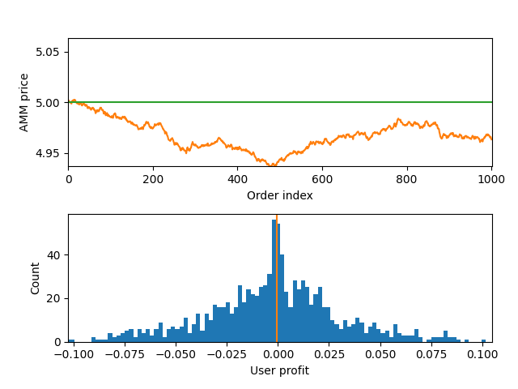
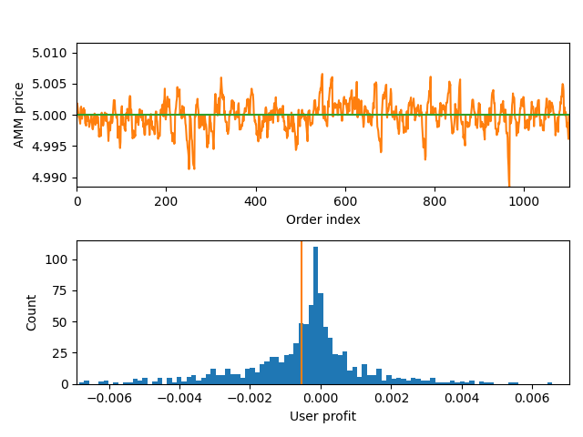
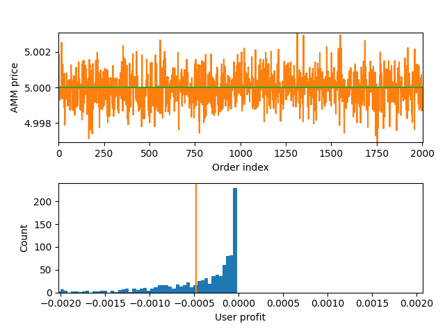
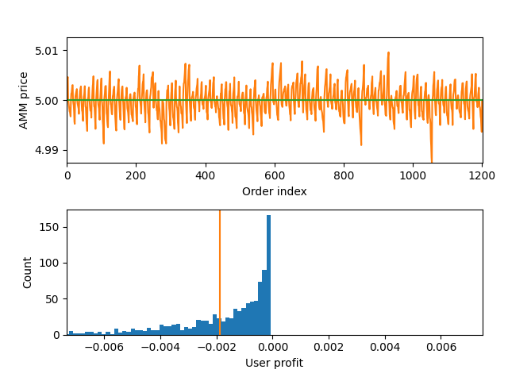
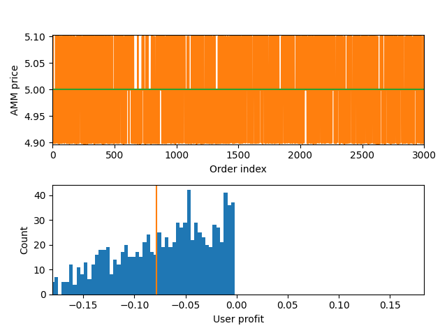
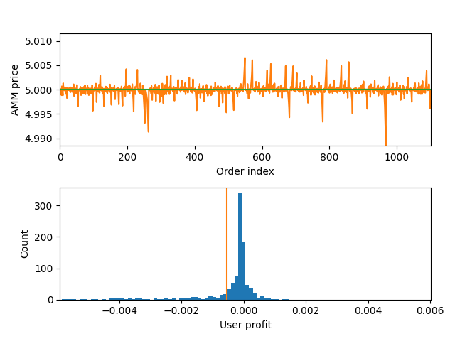

_[Originally posted](https://blog.shutter.network/transaction-ordering-in-automated-market-makers-a-critical-examination-of-impact-and-strategies/) at the Shutter Blog._

# Transaction Ordering in Automated Market Makers: A Critical Examination of Impact and Strategies

Transaction sequencing can get overlooked in decentralized markets but can significantly impact user outcomes.

Let's delve deeper into this subject and explore a few possible transaction sequencing strategies in the context of Automated Market Makers (AMMs) in decentralized finance (DeFi.)

To better understand our topic, let's consider a simplified AMM model: there is only one token, no fees, and the slippage is linear, meaning the price movement is directly proportional to the transaction amount. Users make random trades, and a sequencer sorts these transactions according to a predefined strategy.

We will evaluate the effectiveness of the Automated Market Maker (AMM) by comparing its users' performance to that of an ideal, maximally liquid exchange with a constant price. We will use a simple model featuring a single pool AMM to do so. Users could buy and sell assets, leading to price fluctuations. The sequencer could reorder transactions, conduct arbitrage against external markets, and inject their own orders. This model helps us better understand the performance of the AMM and its impact on trading.

Why Transaction Ordering Matters
--------------------------------

As the DeFi landscape evolves, it's easy to get caught up in the technological advancements and numerous strategies that shape the ecosystem. It is important to take a moment to understand the underlying reasons behind our discussions and innovations. Transaction ordering, though technical, is more than just a mere cog in the machine. It forms the basis that determines the system's fairness, predictability, and trustworthiness.

The discussion often revolves around Ethereum's rollups, which are considered a solution to the scalability issue in blockchain technology. However, these rollups pose particular challenges, especially regarding how transactions are ordered. This is not only about the system's effectiveness but also about maintaining the decentralization ethos that is highly valued by the DeFi community.

As we venture into the intricate world of DeFi, it's clear that advanced models are necessary. We operate in a domain influenced by dynamic factors like fluctuating market liquidity, rapidly evolving bot strategies, and time-sensitive orders that can significantly impact financial outcomes. In the midst of this complexity, comprehending the significance and implications of transaction ordering is not just desirable but essential.

Effects of Transaction Ordering Strategies
------------------------------------------

The order in which transactions are processed can significantly impact both the user experience and the system's efficiency. The order also affects the Maximal Extractable Value (MEV), which is a critical factor in the DeFi sector. Despite efforts to reduce MEV through solutions like Shutter, the current solutions still allow for sequencer arbitrage, leading to consistent user losses. These issues are even more pronounced in rollups, which are designed for scalability but can be vulnerable to transaction ordering tactics.

DeFi is a complex industry that requires sophisticated models to account for various factors, such as market liquidity and bot strategies. Rollups are becoming a popular solution for improving scalability, but it's essential to master the subtleties of transaction ordering. Proper transaction ordering is crucial for maintaining efficiency, decentralization, and ensuring expected and fair user outcomes.

To create a more equitable and robust future for decentralized finance, it is essential to address the challenges presented by MEV in rollups through strategic transaction ordering. Different methods for arranging transactions are available, each with its own effect on the balance of profit and loss in the digital exchange sphere. This emphasizes the significance of employing strategic approaches to the sequencing of transactions to benefit both users and sequencers.

There are various strategies available that range from simple to more complicated ones.In this post, we will be covering these specific strategies and comparing them using simulations based on our simple DEX model described above:

-   Random Ordering
-   Random Ordering With Arbitrage
-   Random With Backruns
-   Backrun Maximizing
-   Ordering With Sandwiching
-   MEV (Maximal Extractable Value) Minimizing

| Strategy | User Experience Impact | System Efficiency Impact | Sequencer Benefit | Additional Notes |
| --- | --- | --- | --- | --- |
| Random Ordering | Neutral: Users experience unpredictable price fluctuations. No user loss. | The approach is clear and straightforward, but it might create arbitrage opportunities. | Limited; does not exploit price discrepancies for profit. | Unrealistic due to open arbitrage opportunities. A sequencer adopting a Random Ordering strategy is unlikely. |
| Random Ordering With Arbitrage | Tightens profit distribution for users; aligns AMM price more closely with the market price. Minimal user loss. | Improves efficiency by aligning prices closer to actual market values. | High: Sequencer takes the arbitrage opportunity after every block. A sequencer can profit from user transactions by exploiting price discrepancies. | Improves real-world dynamics reflection without harming user experience. Price is more aligned with actual price. |
| Random With Backruns | Transactions more accurately reflect the real-time price changes, reducing users' opportunity to make a profit. Slightly increased user loss. | Arbitrage after every transaction. The AMM system maintains a close alignment between the price of an external exchange and within the platform, resulting in improved price accuracy. | Moderate; Sequencer benefits by keeping transaction order close to market prices and allows for precise control over the order, providing opportunities for benefiting from the timing and order of trades. | The focus is on maintaining transaction synchronization with real-time prices, which affects the distribution of profits. More inefficient. Price is maximally close to actual price. |
| Backrun Maximizing | For initial transactions in a batch, favorable rates apply, but subsequent transactions receive less favorable rates. User loss increases even more. | Arbitrage after every block. Transactions are grouped by type, which can increase the sequencer's potential profit. However, this may have a disadvantageous impact on users. | High: Reorder transactions in a block such that arbitrage opportunity is maximized. To maximize profits, the transactions are sequenced to benefit the sequencer. | Introduces a clear advantage for the sequencer at the cost of user experience in batched transactions. |
| Ordering With Sandwiching | Manipulating prices against user transactions is a direct disadvantage to users. Extreme user loss. | The sequencer sandwiches every single trade. Efficient for the sequencer, exploiting user transactions for profit. | Very high: Enables the sequencer to add transactions that can manipulate the market price in order to make a profit. | Severely impacts user transactions by "Sandwiching" them with sequencer-initiated transactions. |
| MEV Minimizing | The goal is to redistribute MEV across transactions, but the average user still experiences consistent losses despite this effort. | Aims to closely align the price listed on AMM with the actual market price. | Neutral; the sequencer's average profit from arbitrage remains unchanged despite transaction reordering. | Introduces a fairer way of handling transactions, but it comes at the cost of slightly reduced user benefits. Though also unrealistic in terms of adoption. |

### Random Ordering

Transactions are ordered randomly. This strategy is simple but may leave room for unexploited arbitrage opportunities, as it needs to account for price movements on an external exchange.

The Random Ordering strategy often results in random price movements in transaction ordering. Users stand on neutral ground where the profit likelihood hovers around 50%. Every transaction nudges the price in an unfavorable direction, leading to a slightly negative profit. However, this approach is rarely practical in real-market dynamics. This issue in practicality is because, in globally decentralized transaction systems, determining the first transaction on time scales below four seconds is subjective due to network round-trip latency.

### Random Ordering With Arbitrage

Similar to Random Ordering, with the addition that the sequencer performs arbitrage against the external exchange at the end of each block, exploiting the price discrepancies between the AMM and the external exchange.

Diving into an evolved transaction ordering strategy, the 'Random Ordering With Arbitrage' method provides a more grounded reflection of real-world market dynamics than Random Ordering. In this approach, even though users still find their profit potential hovering around a neutral zero, the range of this distribution tightens significantly.

This shift results from the AMM price consistently aligning more closely with the actual market price. A key beneficiary in this setup is the sequencer, which can reliably extract profits, particularly by capitalizing on the price deviations initiated by user transactions. This divergence from the actual price, which in the classic Random Ordering method would have remained as unclaimed MEV, is now seamlessly routed into the sequencer's coffers. Yet, it's pivotal to note that this shift in profit direction doesn't dent the user experience, as their potential outcomes remain largely unaltered between both strategies.

### Random With Backruns

This strategy is akin to Random Ordering, but arbitrage is performed after each transaction, which keeps the AMM price closely aligned with the external exchange.

Advancing into another refined strategy, 'Random With Backruns,' keeps the transaction pulse in sync with real-time price dynamics. Here, an intriguing shift occurs: users invariably find themselves trading at the authentic market price, or more accurately, within a slim margin defined by the actual price and the one post their transaction.This seemingly advantageous alignment, however, brings forth a challenge.

Consistent trading at or near the actual price erases any room for profit-making on the part of the users. Yet, when you zoom out and analyze the broader picture, the average profit potential for users remains untouched. This is because, historically, their transactions were, on average, executed at this actual price. What's altered isn't the profit but rather the distribution of the potential gains and losses, now reflecting a more uniform landscape.

### Backrun Maximizing

Transactions are grouped by type (buy or sell) and sequenced together, with arbitrage performed after each group of transactions.

Diving deeper into transaction strategies, 'Backrun Maximizing' introduces a paradigm shift. Here, for the first time, we see the rollup sequencer taking the reins, actively reordering transactions based on their intent: buying or selling. But this approach only bodes well for some users. In this configuration, only the initial transaction in the buy or sell category seizes the authentic market price. Each subsequent transaction in that batch faces progressively less favorable rates, tilting the scale away from the user's advantage.

In this dance of numbers, what users lose, the sequencer gains, turning those disparities into profits. However, there's a cap to this model's potential---dictated by block time. The longer a block's duration, the more transactions it can batch, amplifying the sequencer's sway and influence on outcomes.

### Ordering With Sandwiching

The sequencer inserts transactions before and after each user transaction to move the price in the sequencer's favor, effectively "Sandwiching" the user's transaction.

The 'Ordering With Sandwiching' strategy is where the tides turn fully in favor of the sequencer at the expense of users. In this approach, the sequencer cunningly places transactions before and after each user's transaction. By doing so, the sequencer can tactically shift the price in its desired direction, encapsulating the user's transaction within a price-altering embrace.

Remarkably, this doesn't require juggling transaction orders; it's a mere act of inserting front running and backrun transactions. However, this strategy has its bounds. The extent to which a sequencer can exploit this method is constrained by the slippage users are willing to tolerate. The tighter the user-defined slippage, the less room for the sequencer's play.

### MEV (Maximal Extractable Value) Minimizing

Transactions are ordered such that the AMM price is as close as possible to the actual price, with arbitrage performed at the end of the block.

The "MEV Minimizing" strategy introduces a redistributive approach to transaction ordering. By keenly organizing transactions, the aim is to align the Automated Market Maker (AMM) price as closely as possible to the actual market price. In this system, the MEV generated by certain transactions is effectively "given back" by redistributing it among other transactions. This reshuffling reduces extreme price fluctuations as they tend to neutralize one another.

While it might seem advantageous, it's pivotal to note that the average loss for users remains consistent. Given the model's linearity, the average profit extracted by sequencer arbitrage remains unchanged regardless of transaction sequence. In essence, it operates akin to a version of "backrun after each transaction" but with the advantage of reduced overhead, albeit with slightly compromised user benefits.

### Understanding the Digital Marketplace

The strategies used to order transactions in the DeFi industry can have a significant impact. Each approach has its own benefits and difficulties, but it's crucial to comprehend their consequences. The adopted strategy determines the balance of power, from safeguarding user interests to ensuring the profitability of the sequencer. Keeping up-to-date with DeFi's ongoing changes and making informed decisions will contribute to a more equitable, transparent, and stable digital financial future.

Key Takeaways
-------------

-   Decentralized Finance (DeFi) can be complex, and transaction ordering strategies like Ordering With Sandwiching can harm users
-   We believe that random ordering through an arbitrage approach can benefit users and ensure market efficiency. This approach strikes the best balance and is the most achievable in our view
-   Understanding DeFi dynamics is vital to creating a fair and less adversarial environment for participants
-   Minimizing Maximal Extractable Value (MEV) through strategic ordering can align decentralized exchange prices more closely with those of centralized counterparts
-   An external market serves as a benchmark for the 'actual price,' guiding sequencers in their arbitration efforts
-   Understanding transaction ordering within DeFi is crucial for designing platforms and regulatory approaches that foster a fair, resilient, and equitable ecosystem

DeFi is a complex system. Reordering transactions can harm users, while Random Ordering With Arbitrage can benefit them. Understanding DeFi dynamics can create a fair environment for participants. Minimizing MEV doesn't necessarily reduce user losses but improves user experience. Aligning DEX prices with centralized counterparts distributes profits more equitably. Understanding transaction ordering is crucial for a fair and equitable DeFi ecosystem. Encrypted mempools and informed ordering strategies are crucial for the future of DeFi. Shutter's implementation of encrypted mempools results in random ordering with arbitrage, making it highly useful for all.

Transaction ordering is a crucial element that can significantly impact the entire DeFi market experience and is not just a technical detail. Navigating its nuances demands knowledge, transparency, and relentless research.
