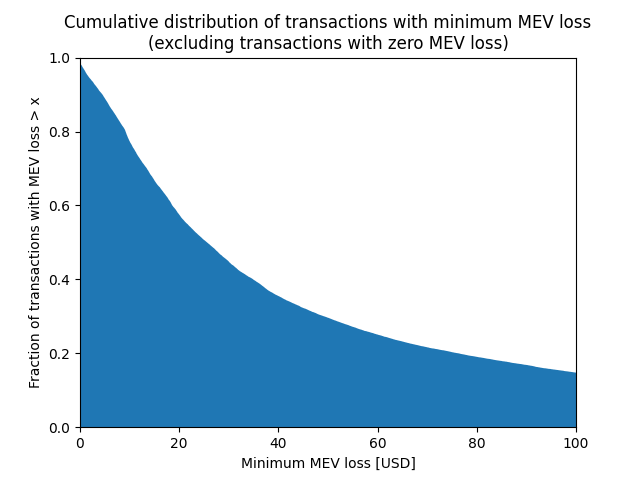
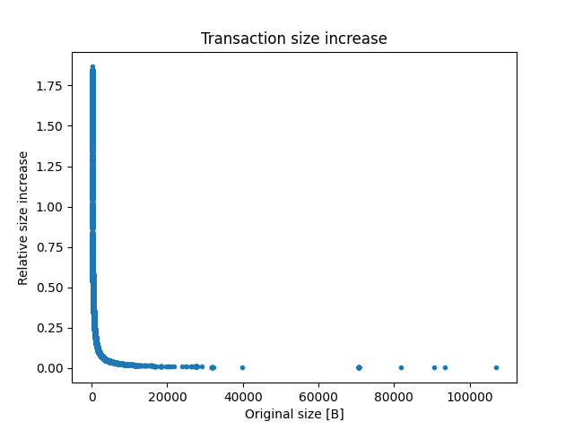
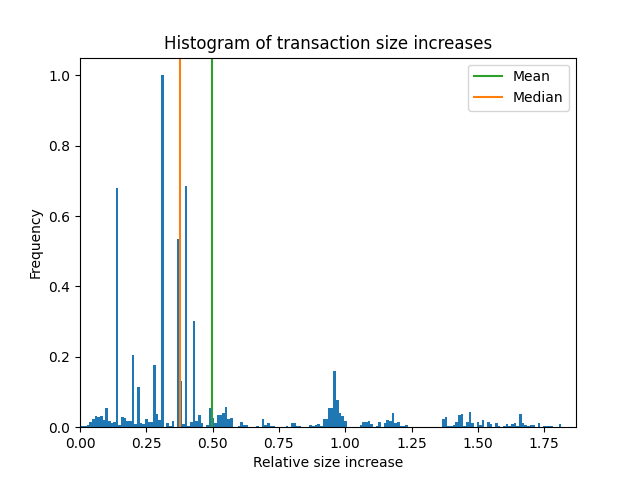

_[Originally posted](https://shutternetwork.discourse.group/t/the-viability-of-integrating-an-encrypted-mempool-as-proposed-by-shutter-into-the-op-stack/112) at the Shutter Forum._

# The Viability of Integrating an Encrypted Mempool as Proposed by Shutter Into the OP Stack

This post delves into the financial setbacks users endure due to MEV on Ethereum. Leveraging this data, we've extrapolated that around 20,000 transactions per week on [Optimism](https://www.optimism.io/) could potentially reap the benefits of encryption. Subsequently, we've deduced that encrypted transactions could foresee a fee hike of 37.5%, with an additional 6 cents, justifying the investment.

To determine the number of transactions that might utilize Shutter when integrated into the [OP Stack](https://stack.optimism.io/), it's essential to gauge how many would potentially benefit from it. Shutter's fundamental offerings encompass heightened censorship resistance and enhanced protection against front-running. For most users, the lack of censorship resistance is not a practical concern today. On the other hand, many users do suffer from the effects of front-running.

Our insights are based on data provided by [Zeromev](https://zeromev.org/). They continuously monitor Ethereum Layer 1 blocks, identifying front-running victims and computing their associated financial losses. Given the intrinsic complexities of quantifying MEV and the propensity to overlook specific front-running occurrences, Zeromev's figures should be interpreted as a conservative, minimum estimate.

## Expected Volume

To estimate the number of transactions that would use Shutter if available in the OP Stack, we must consider how many would benefit from it. Shutter's core value propositions are increased censorship resistance and protection against front-running. Insufficient censorship resistance is not a practical concern today for the vast majority of users. On the other hand, many users do suffer from front-running.

We base our analysis on data provided by [Zeromev](https://zeromev.org/). They continuously monitor Ethereum L1 blocks, search for victims of front-running, and quantify their loss in USD. As measuring MEV is an inherently difficult problem and front-running events, in particular, are easily missed, their data must be considered a lower bound. Consequently, our estimate is a relatively cautious minimum estimate.

Examining Zeromev's data in the week from July 31st to August 6th, 2023, we find 30740 transactions losing $2.29M in total. As the cumulative histogram below shows, in almost all cases (>99%), the loss is greater than $1 and thus significant concerning typical transaction fees on Optimism.

The total number of transactions on Ethereum in the same period was 7,395,134. Thus, the fraction of transactions with significant MEV loss is about 0.4%. This number takes into account all transactions, including non-MEV-generating ones such as token transfers. It would be much higher if we restricted the analysis to, say, DeFi or AMM transactions. Assuming the same ratio at Optimism, during a typical week with about 5M transactions, the expected volume of encrypted transactions would be 20,000.

## Transaction Fees

Encrypted transactions will have higher transaction fees than standard ones. This is due to increased costs, which can be divided into fixed system costs and per-transaction costs.

### Fixed Costs

The fixed system costs are mainly incurred due to operating the key generation infrastructure. The hardware requirements for the keyper nodes are reasonably low. At 50 keyper nodes, a conservative estimate of USD $100 per month results in yearly total operating costs of USD $60,000. This corresponds to a transaction fee increase of 6 ct at the expected weekly throughput of 20,000 transactions estimated above.

### Per-transaction Costs

#### L1 Calldata Costs

Due to their increased size, encrypted transactions have a larger L1 calldata footprint, leading to higher transaction fees. A sample of 300,000 user transactions on Optimism has been analyzed to estimate the impact. Contract creations and transactions that specify access lists, which constitute less than 0.03% of the data set, are ignored for simplicity.

The scatter plot below portrays how encryption would affect the size of the transactions. Only small transactions increase noticeably, up to a factor of 2.75. The largest transactions of more than a few kB grow almost not at all. To consider how often transactions of different sizes appear, the following figure shows a histogram of the size increase. The mean size increase is 49.9%, the median is 37.6%. The latter number is the size increase we expect from a typical transaction.

In the "worst case" scenario in which the transaction fee is entirely due to L1 calldata costs, a size increase translates directly into a fee increase. That is, the transaction fee of an average encrypted transaction can be assumed to be 37.5% higher compared to a standard one.

Note that this analysis does not consider calldata compression, as its efficiency is difficult to estimate on a per-transaction basis. As encrypted data is generally incompressible, encrypted transactions are assumed to be less compressible than traditional ones (however, the question is not as simple as shutterized transactions also contain plaintext metadata, and compressing before encrypting is also an option).

One last thing to mention is that this analysis is based on the simplest way to integrate Shutter into Optimism. For future versions, we proposed a protocol variation that drastically reduces the L1 footprint at the cost of higher complexity.

#### Decryption Overhead

Encrypted transactions have to be decrypted before they can be executed. This preprocessing step is purely computational. The decryption overhead is negligible as computation costs on Optimism are small compared to L1 calldata costs.

## Conclusion

In this post, we examined user losses incurred due to MEV on Ethereum. We used it to estimate that about 20,000 transactions per week could benefit from using encrypted transactions on Optimism, i.e., the user's net transaction outcome after all fees would be better with the encryption than without.

Next, we estimated an increase of transaction fees by 37.5% plus USD 0.06 for using encrypted transactions, which would be a worthwhile investment. As this is a conservative estimate, we believe the benefits in practice will be much higher, especially with the growing usage of Optimism and L2s in general.
